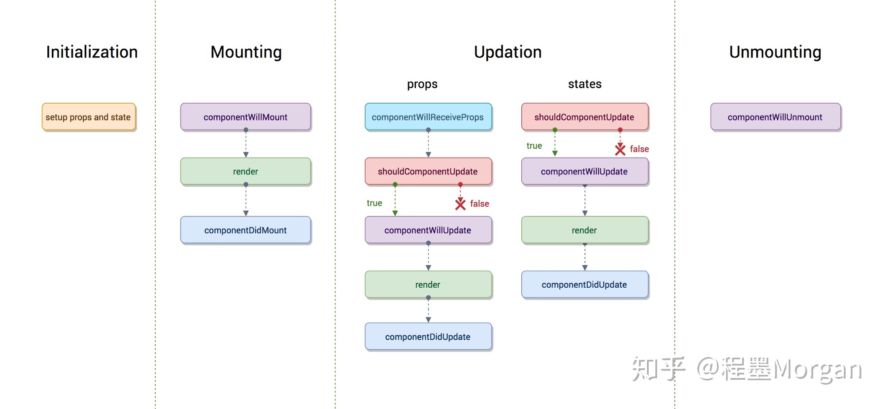

#React 生命周期



##1、组件初始化

就是 执行 constructor(),  super(props) 用来调用基类的构造方法constructor()

##2、组件挂载 Mounting

此阶段分为componentWillMount，render，componentDidMount三个时期。

* componentWillMount：

  在组件挂载到DOM前调⽤，且只会被调⽤一次，在这边调用this.setState不会引起组件重新渲染，也
  可以把写在这边的内容提前到constructor()中，所以项⽬目中很少用。

- render：

  根据组件的props和state(无两者的重传递和重赋值，无论值是否有变化，都可以引起组件重新render) ，return 一个React元素(描述组件，即UI)，不负责组件实际渲染工作，之后由React⾃身根据此元素去渲染出⻚面DOM。

  render是纯函数(Pure function:函数的返回结果只依赖于它的参数;函数执行过程⾥面没有副作用)，不能在⾥面执行this.setState，会有改变组件状态的副作⽤。

- componentDidMount：

  组件挂载到DOM后调用，且只会被调用一次

## 3、组件的更新 update

react组件更新机制：setState引起的state更新或父组件重新render引起的props更新，更新后的state和props相对之前无论是否有变化，都将引起子组件的重新render。[详情](<https://www.cnblogs.com/penghuwan/p/6707254.html>)

#### 造成组件更新有两类(三种)情况：

- 1.父组件重新render

  父组件重新render引起子组件重新render的情况有两种

  a.直接使用：每当父组件重新render导致的重传props，子组件将直接跟着重新渲染，⽆论props是否有变化。可通过shouldComponentUpdate⽅法优化

  ```jsx
  class Child extends Component {
  		shouldComponentUpdate(nextProps){ // 应该使用这个方法，否则无论props是否有变化都将会导致组件跟着重新渲染
          if(nextProps.someThings === this.props.someThings){
            	return false
  				} 
  		}
      render() {
          return <div>{this.props.someThings}</div>
  		} 
  }
  ```

  b.在componentWillReceiveProps方法中，将props转换成自己的state

  ```react
  class Child extends Component {
      constructor(props) {
          super(props);
          this.state = {
              someThings: props.someThings
          };
  		}
  		componentWillReceiveProps(nextProps) { // 父组件重传props时就会调用这个⽅法
          this.setState({someThings: nextProps.someThings});
      }
      render() {
          return <div>{this.state.someThings}</div>
  		} 
  }
  ```

  根据官网的描述

  > 在该函数(componentWillReceiveProps)中调用this.setState()将不会引起第二次渲染

- 2.组件本身调用setState，无论state 有没有变化。可通过shouldComponentUpdate方法优化。

```jsx
class Child extends Component {
   	constructor(props) {
        super(props);
        this.state = {
          	someThings:1
				} 
		}
		shouldComponentUpdate(nextStates){ // 应该使⽤这个方法，否则无论state是否有变化都将会导致组件重新渲染
				if(nextStates.someThings === this.state.someThings){
						return false
      	}
    }
		handleClick = () => { // 虽然调⽤了setState ，但state并⽆变化 
      	const preSomeThings = this.state.someThings
        this.setState({
          someThings: preSomeThings
        }) 
    }
    render() {
        return <div onClick = {this.handleClick}>{this.state.someThings}</div> 
    }
}
```

**此阶段分为componentWillReceiveProps，shouldComponentUpdate，ComponentWillUpdate，render，componentDidUpdate**

- componentWillReceiveProps(nextProps)

此方法只调⽤于props引起的组件更新过程中，参数nextProps是父组件传给当前组件的新props。

但⽗组件render方法的调⽤不能保证重传给当前组件的props是有变化的，所以在此⽅法中根据nextProps和this.props来查明重传的props是否改变，以及如果改变了要执行啥，⽐比如根据新的props调用this.setState触发当前组件的重新render

- shouldComponentUpdate(nextProps, nextProps)

此⽅法通过比较nextProps，nextState及当前组件的this.props，this.state，返回true时当前组件将继续执⾏更新过程，返回false则当前组件更新停止，以此可⽤来减少组件的不必要渲染，优化组件性能。

ps:这边也可以看出，就算componentWillReceiveProps()中执⾏了this.setState，更新了state，但在render前(如shouldComponentUpdate，componentWillUpdate)，this.state依然指向更新前的state，不然nextState及当前组件的this.state的对比就⼀直是true了。

- componentWillUpdate(nextProps, nextState)

此方法在调用render方法前执行，在这边可执行⼀些组件更新发生前的工作，一般较少用。

- render

同上文，这边只是重新调用

- componentDidUpdate(prevProps，prevState)

此⽅法在组件更新后被调用，可以操作组件更新的DOM，prevProps和prevState这两个参数指的是组件更新前的props和state 

## 组件卸载阶段

此阶段只有一个生命周期方法：

- componentWillUnmount

此⽅法在组件被卸载前调用，可以在这里执行一些清理工作，⽐如清楚组件中使用的定时器，清楚
componentDidMount中⼿动创建的DOM元素等，以避免引起内存泄漏。


# React v16.4的生命周期

#### 变更缘由

原来（React v16.0前）的生命周期在React v16推出的[Fiber](https://links.jianshu.com/go?to=https%3A%2F%2Fzhuanlan.zhihu.com%2Fp%2F26027085)之后就不合适了，因为如果要开启async rendering，在render函数之前的所有函数，都有可能被执行多次。

原来（React v16.0前）的生命周期有哪些是在render前执行的呢？

- componentWillMount

- componentWillReceiveProps

- shouldComponentUpdate

- componentWillUpdate

如果开发者开了async rendering，而且又在以上这些render前执行的生命周期方法做AJAX请求的话，那AJAX将被无谓地多次调用。。。明显不是我们期望的结果。而且在componentWillMount里发起AJAX，不管多快得到结果也赶不上首次render，而且componentWillMount在服务器端渲染也会被调用到（当然，也许这是预期的结果），这样的IO操作放在componentDidMount里更合适。

禁止不能用比劝导开发者不要这样用的效果更好，所以除了shouldComponentUpdate，其他在render函数之前的所有函数（componentWillMount，componentWillReceiveProps，componentWillUpdate）都被getDerivedStateFromProps替代。

也就是用一个静态函数getDerivedStateFromProps来取代被deprecate的几个生命周期函数，就是强制开发者在render之前只做无副作用的操作，而且能做的操作局限在根据props和state决定新的state

React v16.0刚推出的时候，是增加了一个componentDidCatch生命周期函数，这只是一个增量式修改，完全不影响原有生命周期函数；但是，到了React v16.3，大改动来了，引入了两个新的生命周期函数： **getDerivedStateFromProps**，**getSnapshotBeforeUpdate** 


#### getDerivedStateFromProps

`getDerivedStateFromProps`本来（React v16.3中）是只在创建和更新（由父组件引发部分），也就是不是由父组件引发，那么getDerivedStateFromProps也不会被调用，如自身setState引发或者forceUpdate引发。

#### React v16.3 的生命周期图


这样的话理解起来有点乱，在React v16.4中改正了这一点，让getDerivedStateFromProps无论是Mounting还是Updating，也无论是因为什么引起的Updating，全部都会被调用，具体可看React v16.4 的生命周期图。

#### React v16.4 的生命周期图


#### React v16.4后的getDerivedStateFromProps

**static getDerivedStateFromProps(props, state)** 在组件创建时和更新时的render方法之前调用，它应该返回一个对象来更新状态，或者返回null来不更新任何内容。

#### 注意：

- getDerivedStateFromProps前面要加上static保留字，声明为静态方法，不然会被react忽略掉

- getDerivedStateFromProps里面的this为undefined

### getSnapshotBeforeUpdate

**getSnapshotBeforeUpdate()** 被调用于render之后，可以读取但无法使用DOM的时候。它使您的组件可以在可能更改之前从DOM捕获一些信息（例如滚动位置）。此生命周期返回的任何值都将作为参数传递给componentDidUpdate（）。

官网给的例子：

```jsx
class ScrollingList extends React.Component {
  constructor(props) {
    super(props);
    this.listRef = React.createRef();
  }

  getSnapshotBeforeUpdate(prevProps, prevState) {
    //我们是否要添加新的 items 到列表?
    // 捕捉滚动位置，以便我们可以稍后调整滚动.
    if (prevProps.list.length < this.props.list.length) {
      const list = this.listRef.current;
      return list.scrollHeight - list.scrollTop;
    }
    return null;
  }

  componentDidUpdate(prevProps, prevState, snapshot) {
    //如果我们有snapshot值, 我们已经添加了 新的items.
    // 调整滚动以至于这些新的items 不会将旧items推出视图。
    // (这边的snapshot是 getSnapshotBeforeUpdate方法的返回值)
    if (snapshot !== null) {
      const list = this.listRef.current;
      list.scrollTop = list.scrollHeight - snapshot;
    }
  }

  render() {
    return (
      <div ref={this.listRef}>{/* ...contents... */}</div>
    );
  }
}
```

